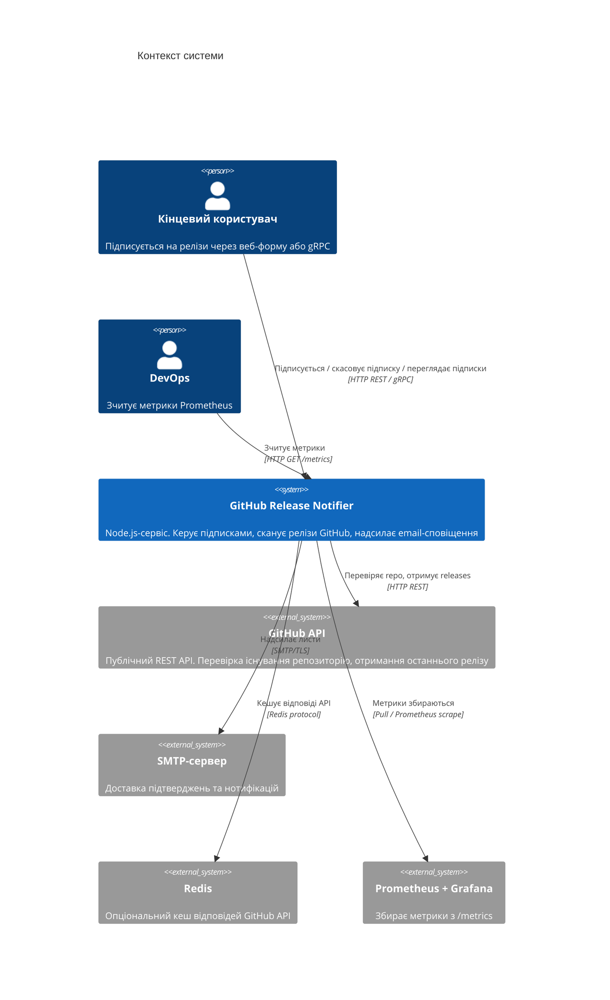
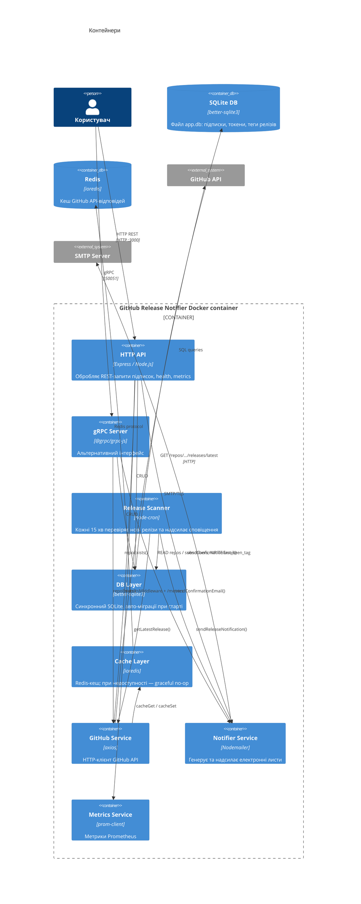
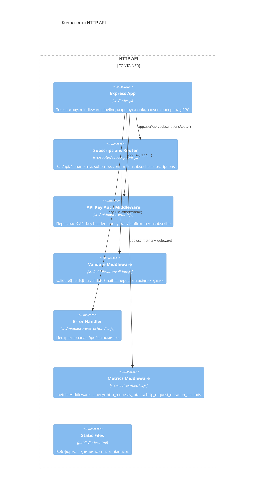
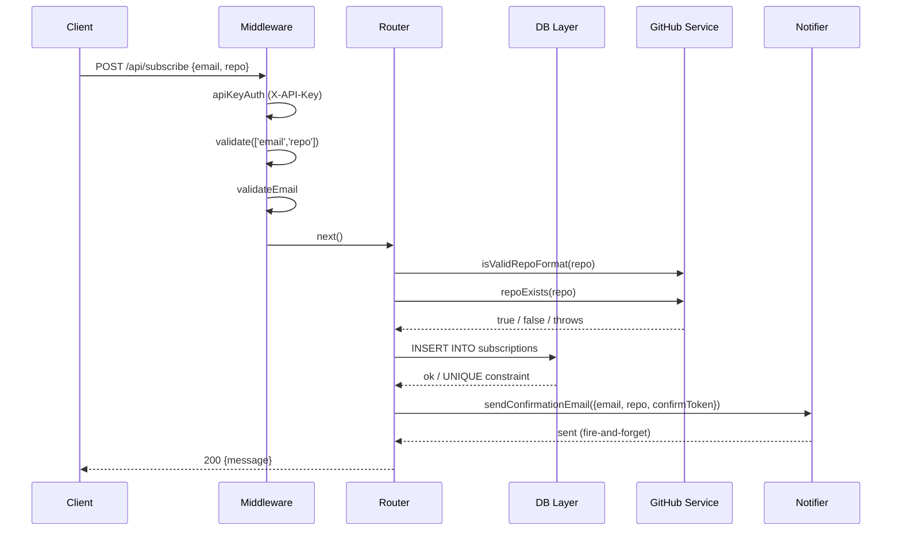
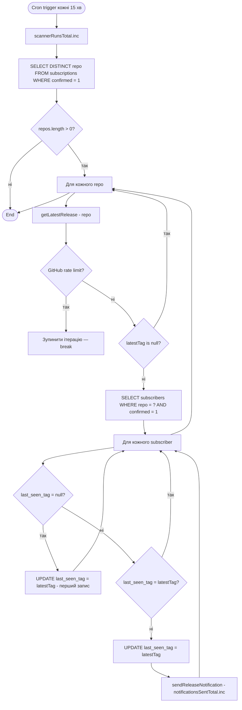
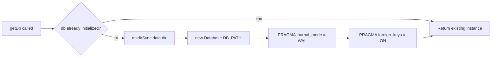
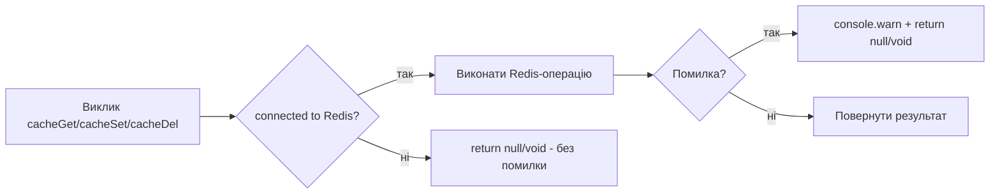
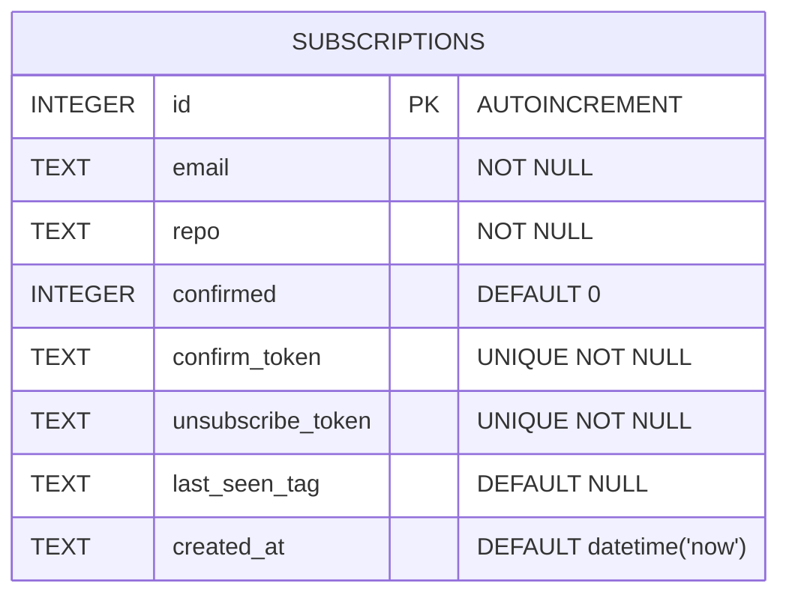
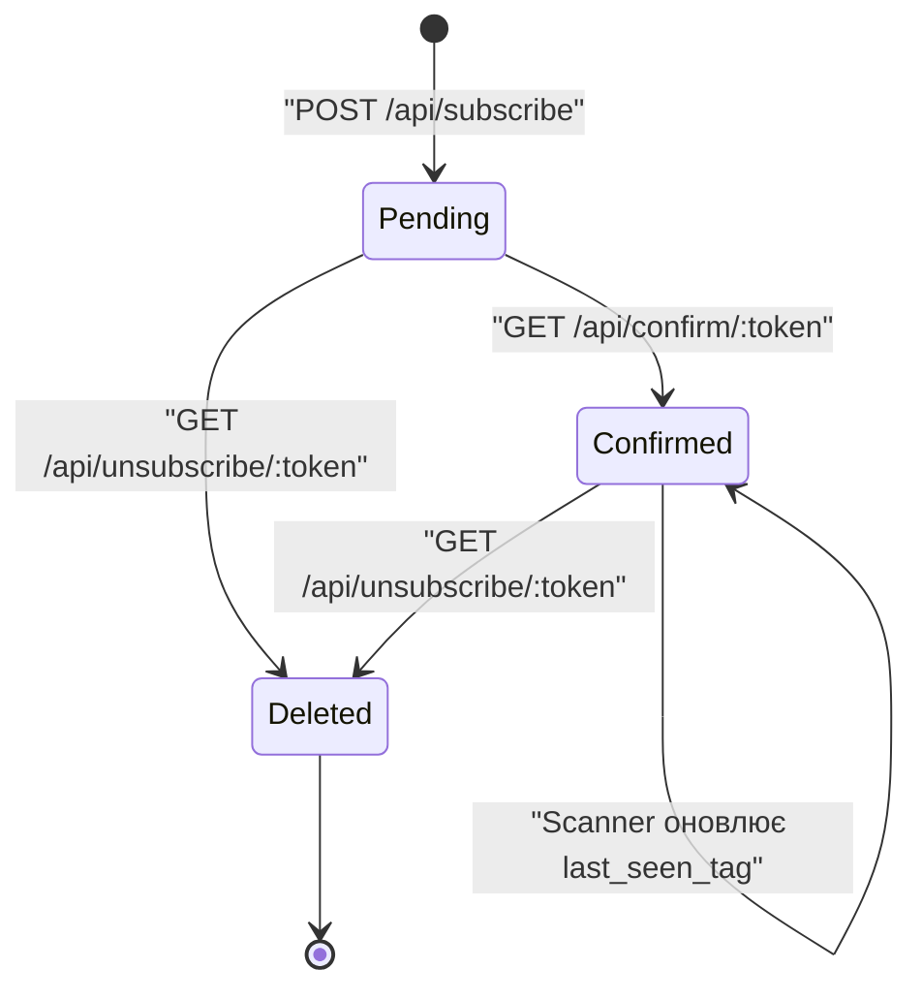
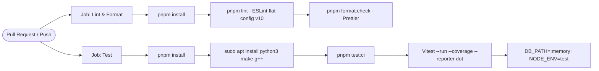

# System Design Document

**_Зміст_**

- [System Design Document](#system-design-document)
    - [1. Вимоги](#1-вимоги)
        - [1.1 Функціональні вимоги](#11-функціональні-вимоги)
        - [1.2 Нефункціональні вимоги](#12-нефункціональні-вимоги)
        - [1.3 Обмеження та припущення](#13-обмеження-та-припущення)
    - [2. Оцінка навантаження](#2-оцінка-навантаження)
        - [2.1 Користувачі та підписки](#21-користувачі-та-підписки)
        - [2.2 Трафік та пропускна здатність](#22-трафік-та-пропускна-здатність)
        - [2.3 Зберігання даних](#23-зберігання-даних)
        - [2.4 Redis](#24-redis)
    - [3. High-level архітектура](#3-high-level-архітектура)
        - [3.1 C4 — Рівень 1: Контекст системи](#31-c4--рівень-1-контекст-системи)
        - [3.2 C4 — Рівень 2: Контейнери](#32-c4--рівень-2-контейнери)
    - [4. Детальний дизайн компонентів](#4-детальний-дизайн-компонентів)
        - [4.1 HTTP API](#41-http-api)
            - [C4 — Рівень 3: Компоненти HTTP API](#c4--рівень-3-компоненти-http-api)
            - [Middleware pipeline](#middleware-pipeline)
            - [Потік підписки (POST /api/subscribe)](#потік-підписки-post-apisubscribe)
        - [4.2 gRPC-сервер](#42-grpc-сервер)
            - [Сервіс `SubscriptionService`](#сервіс-subscriptionservice)
            - [Таблиця gRPC статусів](#таблиця-grpc-статусів)
            - [Порт: `GRPC_PORT` (default: `50051`)](#порт-grpc_port-default-50051)
        - [4.3 Release Scanner](#43-release-scanner)
            - [Алгоритм сканування](#алгоритм-сканування)
        - [4.4 База даних](#44-база-даних)
            - [Стратегія підключення](#стратегія-підключення)
            - [Організація SQL-запитів](#організація-sql-запитів)
        - [4.5 Кеш](#45-кеш)
        - [4.6 GitHub API-клієнт](#46-github-api-клієнт)
            - [Функції](#функції)
            - [Rate limit handling](#rate-limit-handling)
            - [Кешування](#кешування)
            - [Заголовок Authorization](#заголовок-authorization)
        - [4.7 Email-нотифікатор (Nodemailer)](#47-email-нотифікатор-nodemailer)
            - [Функції](#функції-1)
            - [SMTP конфігурація](#smtp-конфігурація)
        - [4.8 Метрики Prometheus](#48-метрики-prometheus)
            - [Зареєстровані метрики](#зареєстровані-метрики)
    - [5. Дизайн бази даних](#5-дизайн-бази-даних)
        - [5.1 ER-діаграма](#51-er-діаграма)
        - [5.2 Індекси та обмеження](#52-індекси-та-обмеження)
        - [5.3 Скінченний автомат підписки](#53-скінченний-автомат-підписки)
        - [5.4 Життєвий цикл підписки](#54-життєвий-цикл-підписки)
    - [6. CI/CD та якість коду](#6-cicd-та-якість-коду)
        - [6.1 GitHub Actions Pipeline](#61-github-actions-pipeline)
        - [6.2 Pre-commit хуки (Lefthook)](#62-pre-commit-хуки-lefthook)

## 1. Вимоги

### 1.1 Функціональні вимоги

| #    | Вимога                                                                                                   |
| ---- | -------------------------------------------------------------------------------------------------------- |
| F-01 | Користувач може підписатися на email-сповіщення про нові релізи будь-якого публічного GitHub-репозиторію |
| F-02 | Після підписки система надсилає підтверджувальний лист з унікальним токеном                              |
| F-03 | Підписка активується лише після переходу за посиланням з листа (`/api/confirm/:token`)                   |
| F-04 | Будь-яка підписка може бути скасована за унікальним посиланням `unsubscribe`                             |
| F-05 | Планувальник перевіряє нові релізи кожні 15 хвилин та надсилає сповіщення                                |
| F-06 | Система дозволяє отримати список підписок за email                                                       |
| F-07 | Система перевіряє існування репозиторію через GitHub API перед збереженням підписки                      |
| F-08 | Усі ті самі операції доступні через gRPC-інтерфейс                                                       |
| F-09 | Метрики Prometheus доступні на `/metrics`                                                                |
| F-10 | Веб-інтерфейс (`public/index.html`) надає форму підписки та список активних підписок                     |

### 1.2 Нефункціональні вимоги

| #     | Вимога                       | Значення                                                                     |
| ----- | ---------------------------- | ---------------------------------------------------------------------------- |
| NF-01 | **Доступність**              | ≥ 99% uptime                                                                 |
| NF-02 | **Затримка відповіді**       | p95 < 500 мс для REST-ендпоінтів                                             |
| NF-03 | **Відтворюваність**          | Збірка відтворювана через `pnpm install --frozen-lockfile`                   |
| NF-04 | **Безпека**                  | API-ендпоінти захищені `X-API-Key`; публічні `/confirm` та `/unsubscribe`    |
| NF-05 | **Спостережуваність**        | HTTP-метрики, кількість підписок, кількість надісланих листів — у Prometheus |
| NF-06 | **Контрактна відповідність** | Усі ендпоінти точно відповідають `swagger.yaml`                              |
| NF-07 | **Ізоляція тестів**          | Unit-тести не мають зовнішніх залежностей; `:memory:` SQLite у CI            |
| NF-08 | **Якість коду**              | ESLint (flat config, v10) + Prettier; pre-commit через Lefthook              |

### 1.3 Обмеження та припущення

- **Єдиний екземпляр:** розгортання — один Node.js-процес; горизонтальне масштабування не передбачено в поточній версії
- **SQLite як БД:** обрано свідомо. Міграція на PostgreSQL — у разі потреби у масштабуванні
- **GitHub Public API:** без авторизації — 60 req/год; з `GITHUB_TOKEN` — 5000 req/год
- **Docker-first:** запуск `docker compose up --build` повністю підіймає сервіс без зовнішніх залежностей
- **Node.js ≥ 20** обов'язковий (нативний ESM, `import.meta.dirname`)

## 2. Оцінка навантаження

### 2.1 Користувачі та підписки

| Метрика                               | Значення        |
| ------------------------------------- | --------------- |
| Очікувана кількість активних підписок | ~1 000 — 10 000 |
| Унікальних репозиторіїв               | ~200 — 2 000    |
| Нових підписок на добу                | ~100            |
| Підтверджень на добу                  | ~80             |

### 2.2 Трафік та пропускна здатність

**REST API:**

- POST /api/subscribe ~10 req/хв
- GET /api/confirm/:t ~8 req/хв
- GET /api/subscriptions ~5 req/хв
- GET /health ~60 req/хв

**Cron Scanner:**

- Кількість репозиторіїв для перевірки: R
- GitHub API запитів за один run: R (один GET /repos/{owner}/{repo}/releases/latest)
- За 1 годину: 4 \* R запитів до GitHub
- Ліміт без токена: 60 req/год → макс. ~15 репозиторіїв
- Ліміт з GITHUB_TOKEN: 5000 req/год → макс. ~1250 репозиторіїв

**Електронна пошта:**

- Нових релізів на добу: ~50
- Середня кількість підписників/repo: ~5
- Email на добу: ~250
- SMTP-запитів на добу: ~250 + ~100 (підтвердження)

### 2.3 Зберігання даних

- Одна підписка в SQLite: ~300 байт
- 10 000 підписок: ~3 МБ
- Ріст за рік (100 нових/д): ~11 МБ

### 2.4 Redis

- TTL ключів: 10 хвилин
- Кеш результатів `getLatestRelease` та `repoExists`
- За відсутності Redis сервіс продовжує роботу

## 3. High-level архітектура

### 3.1 C4 — Рівень 1: Контекст системи



### 3.2 C4 — Рівень 2: Контейнери



## 4. Детальний дизайн компонентів

### 4.1 HTTP API

**Файли:** `src/index.js`, `src/routes/subscriptions.js`, `src/middleware/`

#### C4 — Рівень 3: Компоненти HTTP API



#### Middleware pipeline

```
Запит →
metricsMiddleware →
Static / Health / Metrics →
/api →
Auth Check →
validate →
Router Handler →
DB/GitHub/Notifier →
За помилки errorHandler
```

#### Потік підписки (POST /api/subscribe)



### 4.2 gRPC-сервер

**Файли:** `src/grpc/server.js`, `proto/notifier.proto`

#### Сервіс `SubscriptionService`

```
service SubscriptionService {
  rpc Subscribe       (SubscribeRequest)       returns (SubscribeResponse);
  rpc Confirm         (ConfirmRequest)         returns (ConfirmResponse);
  rpc Unsubscribe     (UnsubscribeRequest)     returns (UnsubscribeResponse);
  rpc GetSubscriptions(GetSubscriptionsRequest) returns (GetSubscriptionsResponse);
}
```

#### Таблиця gRPC статусів

| Ситуація                   | gRPC статус          |
| -------------------------- | -------------------- |
| Відсутній email/repo       | `INVALID_ARGUMENT`   |
| Невалідний email           | `INVALID_ARGUMENT`   |
| Невалідний формат repo     | `INVALID_ARGUMENT`   |
| Repo не знайдено на GitHub | `NOT_FOUND`          |
| GitHub rate limit          | `RESOURCE_EXHAUSTED` |
| Підписка вже існує         | `ALREADY_EXISTS`     |
| Помилка БД                 | `INTERNAL`           |
| Токен не знайдено          | `NOT_FOUND`          |

#### Порт: `GRPC_PORT` (default: `50051`)

### 4.3 Release Scanner

**Файли:** `src/services/scanner.js`

#### Алгоритм сканування



_Примітка: SQL запити скорочено_

**Ключові властивості:**

- Якщо `last_seen_tag IS NULL` — перший запис, нотифікація не надсилається
- При rate limit від GitHub ітерація зупиняється, щоб не витрачати квоту
- При помилці надсилання листа до одного підписника — продовжуємо до наступного
- Розклад налаштовується через `CRON_SCHEDULE`

### 4.4 База даних

**Файли:** `src/db/database.js`, `src/db/queries/`

#### Стратегія підключення



**Ключові властивості:**

- Для єдиного з'єднання впродовж усього виконання було використано патерн Singleton.
- WAL-режим дозволяє одночасне читання кількома читачами при одному записувачі.
- Авто-міграція запускається при старті сервісу, створює таблиці якщо не існують.

#### Організація SQL-запитів

Усі SQL-рядки винесені в окремі модулі:

<details open>
<summary><strong>src/db/queries</strong></summary>

<details>
<summary><code>database.js</code></summary>

- CREATE_TABLE

</details>

<details>
<summary><code>subscription.js</code></summary>

- INSERT
- CONFIRM_BY_TOKEN
- DELETE_BY_TOKEN
- GET_BY_EMAIL

</details>

<details>
<summary><code>repo.js</code></summary>

- GET_CONFIRMED_REPOS
- GET_CONFIRMED_SUBSCRIBERS_BY_REPO
- UPDATE_LAST_SEEN_TAG

</details>

</details>

Це покращує читабельність, дозволяє легко знайти та змінити будь-який запит.

### 4.5 Кеш

**Файли:** `src/services/cache.js`



**Ключові властивості:**

- Сервіс гнучко працює як з Redis, так і без нього
- За недоступності Redis GitHub API завжди викликається напряму
- TTL кешу на 10 хвилин
- `connected` флаг управляється через події Redis `on('error')` та `on('ready')`

### 4.6 GitHub API-клієнт

**Файли:** `src/services/github.js`

#### Функції

| Функція                   | Опис                                                          |
| ------------------------- | ------------------------------------------------------------- |
| `isValidRepoFormat(repo)` | Синхронна валідація формату `owner/repo`                      |
| `repoExists(repo)`        | GET `/repos/{owner}/{repo}` → true/false/throw                |
| `getLatestRelease(repo)`  | GET `/repos/{owner}/{repo}/releases/latest` → tag string/null |

#### Rate limit handling

При HTTP 429 обидві функції кидають об'єкт:

```js
{ status: 429, retryAfter: Number(headers['retry-after']) }
```

Caller (`router` або `scanner`) вирішує як реагувати:

- Router → HTTP 429 клієнту
- Scanner → `break` з ітерацій

#### Кешування

Перед GitHub API запитом → `cacheGet(key)`\
Після успішної відповіді → `cacheSet(key, data)`\
Змінна `key` = `github:{endpoint}:{repo}`

#### Заголовок Authorization

При наявності `GITHUB_TOKEN` передається як `Authorization: Bearer {token}` через типовий `axios.create`.

### 4.7 Email-нотифікатор (Nodemailer)

**Файли:** `src/services/notifier.js`

#### Функції

**`sendConfirmationEmail({ email, repo, confirmToken })`**

Лист містить:

- Пояснення підписки
- Посилання `{BASE_URL}/api/confirm/{confirmToken}` для підтвердження

**`sendReleaseNotification({ email, repo, tag, unsubscribeToken })`**

Лист містить:

- Назва релізу та тег
- Посилання на реліз на GitHub
- Посилання `{BASE_URL}/api/unsubscribe/{unsubscribeToken}` для відписки

#### SMTP конфігурація

| Змінна        | Значення за замовчуванням     |
| ------------- | ----------------------------- |
| `SMTP_HOST`   | `smtp.ethereal.email`         |
| `SMTP_PORT`   | `587`                         |
| `SMTP_SECURE` | `false`                       |
| `SMTP_USER`   | —                             |
| `SMTP_PASS`   | —                             |
| `SMTP_FROM`   | `noreply@github-notifier.dev` |

Транспорт створюється щоразу (`createTransport()` всередині кожної функції), що дозволяє легко замінити SMTP без перезапуску.

### 4.8 Метрики Prometheus

**Файли:** `src/services/metrics.js`

#### Зареєстровані метрики

| Метрика                         | Тип       | Лейбли                | Опис                             |
| ------------------------------- | --------- | --------------------- | -------------------------------- |
| `http_requests_total`           | Counter   | method, route, status | Кількість HTTP-запитів           |
| `http_request_duration_seconds` | Histogram | method, route, status | Тривалість HTTP-запитів          |
| `subscriptions_total`           | Gauge     | —                     | Загальна кількість підписок в БД |
| `confirmed_subscriptions_total` | Gauge     | —                     | Кількість підтверджених підписок |
| `notifications_sent_total`      | Counter   | —                     | Надіслано release-листів         |
| `scanner_runs_total`            | Counter   | —                     | Запусків cron-сканера            |

Плюс усі Node.js метрики від `prom-client.collectDefaultMetrics`, зокрема `heap`, `event loop lag`, `CPU` тощо.

## 5. Дизайн бази даних

### 5.1 ER-діаграма



### 5.2 Індекси та обмеження

```sql
UNIQUE(email, repo)          -- запобігає дублікатам підписок
UNIQUE(confirm_token)        -- кожна підписка має унікальний токен підтвердження
UNIQUE(unsubscribe_token)    -- кожна підписка має унікальний токен відписки
```

### 5.3 Скінченний автомат підписки



### 5.4 Життєвий цикл підписки

1. **Pending** — `confirmed = 0`, лист надіслано, очікуємо підтвердження
2. **Confirmed** — `confirmed = 1`, Scanner включає до перевірки
3. **First scan** — `last_seen_tag = NULL` → встановлюється поточний тег, лист не надсилається
4. **Active** — `last_seen_tag != NULL` → лист надсилається лише при зміні тега

## 6. CI/CD та якість коду

### 6.1 GitHub Actions Pipeline



Обидві роботи запускаються паралельно.

### 6.2 Pre-commit хуки (Lefthook)

```yaml
# lefthook.yml
pre-commit:
    parallel: true
    commands:
        lint:
            glob: "*.js"
            run: pnpm exec eslint --fix {staged_files}
            stage_fixed: true
        format:
            glob: "*.{js,json,md}"
            run: pnpm exec prettier --write {staged_files}
            stage_fixed: true

pre-push:
    jobs:
        - name: packages audit
          run: pnpm audit --audit-level=high
```

**Ключові властивості:**

- ESLint та Prettier запускаються паралельно лише для доданих у коміт файлів
- `stage_fixed: true` автоматично переіндексовує виправлені файли
- `pnpm audit` — перевірка вразливостей перед push
