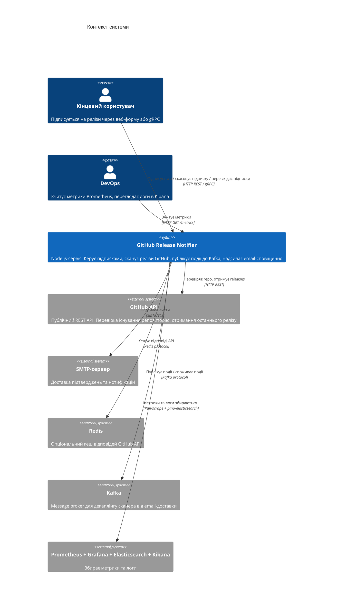
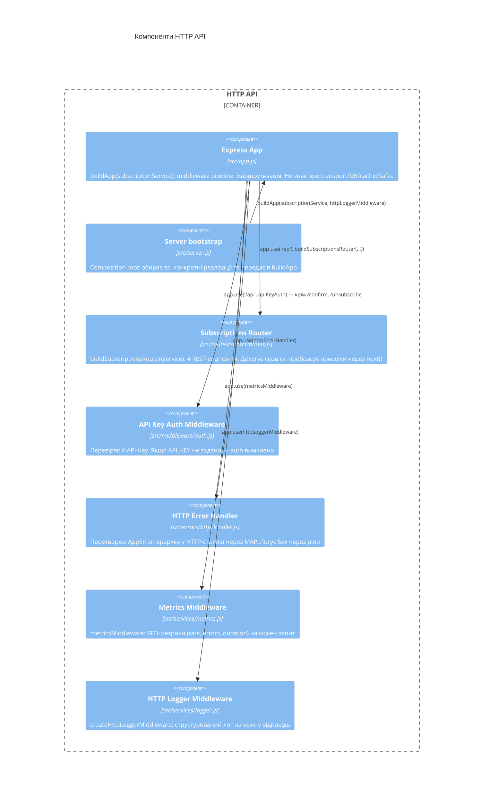
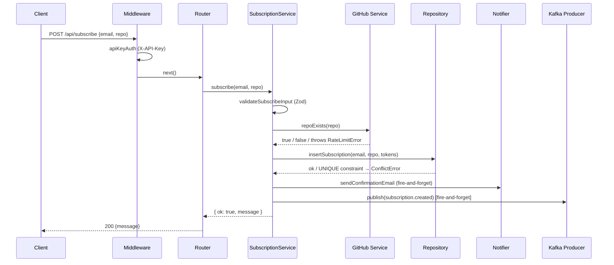
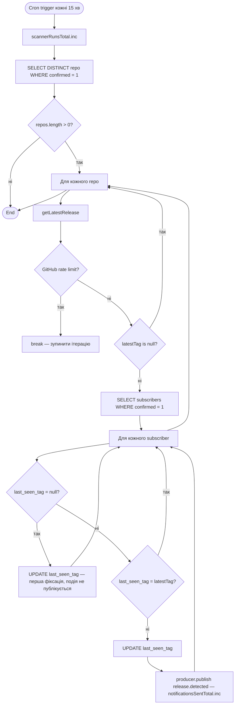
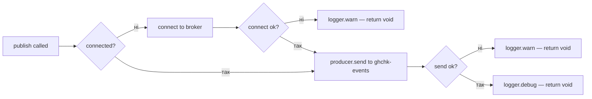
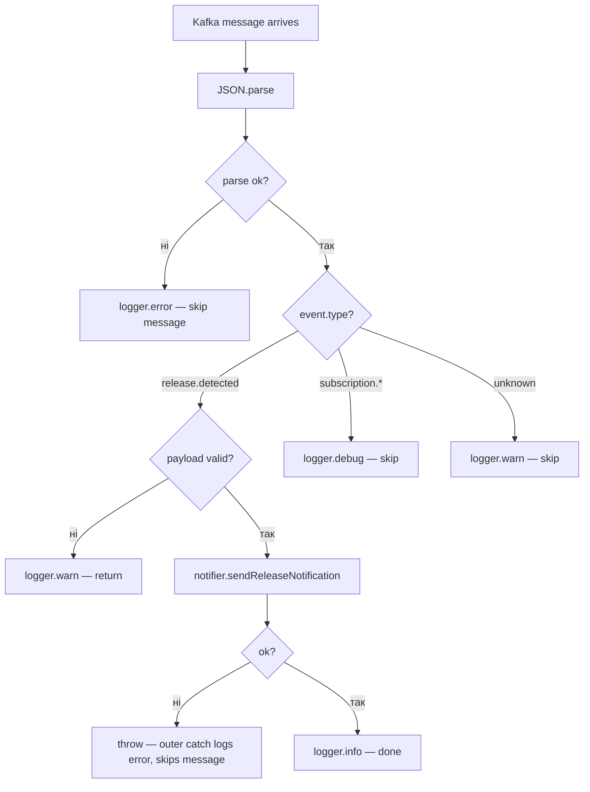
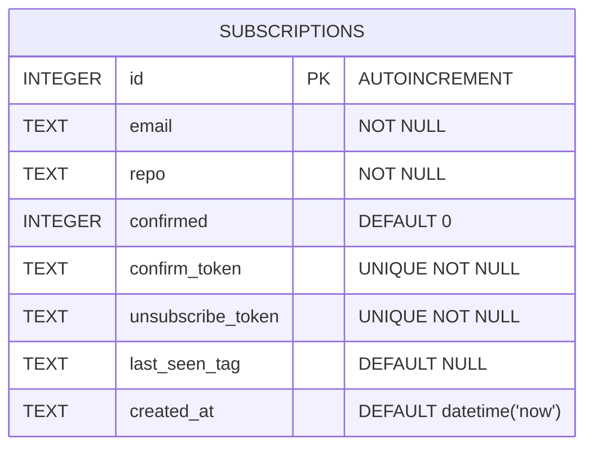
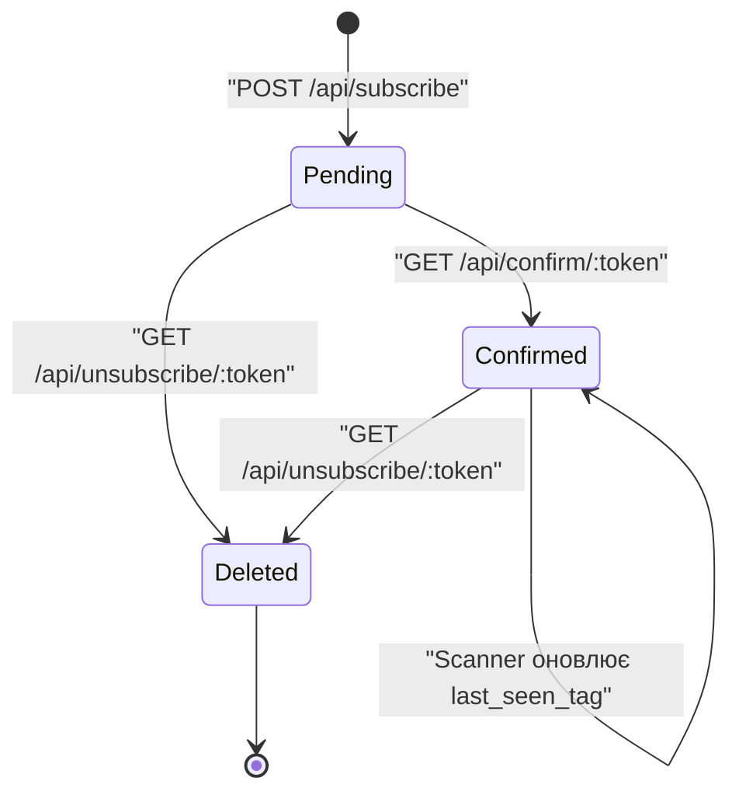
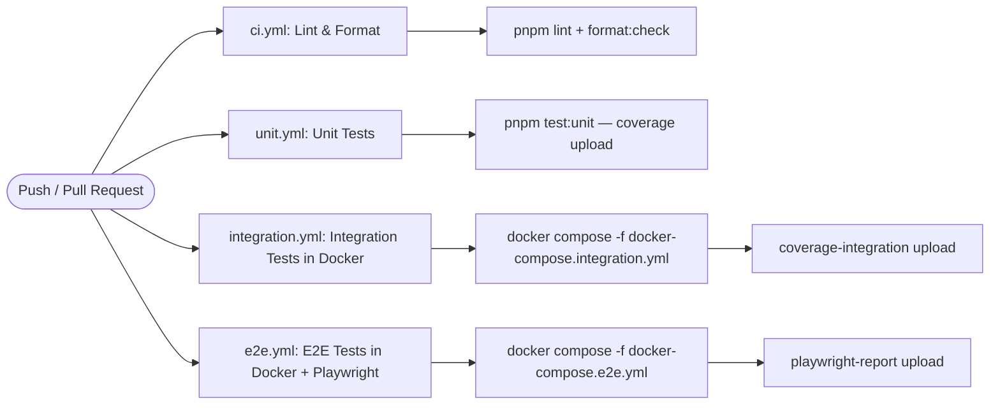

# System Design — GitHub Release Notifier

Сервіс стежить за релізами GitHub-репозиторіїв та надсилає email-сповіщення підписникам. Написаний на Node.js, розгортається через `docker compose up --build` без зовнішніх залежностей.

## 1. Вимоги

**Що система повинна робити:**

- Дозволяти користувачу підписатися на email-сповіщення про нові релізи будь-якого публічного GitHub-репозиторію
- Надсилати підтверджувальний лист після підписки — активація відбувається лише після кліку на `/api/confirm/:token`
- Давати можливість скасувати підписку за унікальним посиланням `unsubscribe`
- Кожні 15 хвилин перевіряти нові релізи та публікувати події до Kafka; Notification Service споживає ці події та надсилає листи
- Надавати список підписок за email
- Перевіряти існування репозиторію через GitHub API перед збереженням
- Дублювати всі операції через gRPC-інтерфейс
- Публікувати метрики Prometheus на `/metrics`
- Мати веб-форму підписки

**Нефункціональне:** uptime ≥ 99%, p95 latency < 500 мс, збірка відтворювана через `pnpm install --frozen-lockfile`, API захищений `X-API-Key` (крім публічних `/confirm` та `/unsubscribe`), unit-тести без зовнішніх залежностей, недоступність Kafka не призводить до помилок HTTP або зупинки сканера.

**Обмеження:** один Node.js-процес, SQLite (міграція на PostgreSQL — при потребі масштабування), без `GITHUB_TOKEN` — 60 req/год, з токеном — 5000 req/год. Kafka в KRaft-режимі, один брокер. Node.js ≥ 20 обов'язковий.

## 2. Оцінка навантаження

Очікувана кількість активних підписок — від 1 000 до 10 000, унікальних репозиторіїв — від 200 до 2 000, нових підписок на добу — ~100, підтверджень — ~80.

REST API отримує приблизно 10 req/хв на `POST /subscribe`, 8 req/хв на `/confirm`, 5 req/хв на `/subscriptions`, 60 req/хв на `/health`. Cron-сканер при R репозиторіях робить R запитів до GitHub кожні 15 хвилин — тобто 4×R запитів на годину. Без токена це максимум ~15 репозиторіїв, з токеном — до ~1250.

По email: ~50 нових релізів на добу × ~5 підписників = ~250 release-листів + ~100 confirmation-листів.

SQLite: одна підписка ~300 байт, 10 000 підписок — ~3 МБ, зростання за рік — ~11 МБ. Redis кешує відповіді GitHub API з TTL 10 хвилин; при його відсутності сервіс продовжує роботу. Kafka: тема `ghchk-events` (один партишн, retention 7 днів), ~250 повідомлень `release.detected` + ~180 subscription-подій на добу, consumer group `ghchk-notification-service`.

## 3. Архітектура (C4)

### Рівень 1 — Контекст системи

```mermaid
C4Context
    title Контекст системи

    Person(user, "Кінцевий користувач", "Підписується на релізи через веб-форму або gRPC")
    Person(infra, "DevOps", "Зчитує метрики Prometheus, переглядає логи в Kibana")

    System(notifier, "GitHub Release Notifier", "Node.js-сервіс. Керує підписками, сканує релізи GitHub, публікує події до Kafka, надсилає email-сповіщення")

    System_Ext(github, "GitHub API", "Публічний REST API. Перевірка існування репозиторію, отримання останнього релізу")
    System_Ext(smtp, "SMTP-сервер", "Доставка підтверджень та нотифікацій")
    System_Ext(redis, "Redis", "Опціональний кеш відповідей GitHub API")
    System_Ext(kafka, "Kafka", "Message broker для декаплінгу сканера від email-доставки")
    System_Ext(observability, "Prometheus + Grafana + Elasticsearch + Kibana", "Збирає метрики та логи")

    Rel(user, notifier, "Підписується / скасовує підписку / переглядає підписки", "HTTP REST / gRPC")
    Rel(notifier, github, "Перевіряє repo, отримує releases", "HTTP REST")
    Rel(notifier, smtp, "Надсилає листи", "SMTP/TLS")
    Rel(notifier, redis, "Кешує відповіді API", "Redis protocol")
    Rel(notifier, kafka, "Публікує події / споживає події", "Kafka protocol")
    Rel(infra, notifier, "Зчитує метрики", "HTTP GET /metrics")
    Rel(notifier, observability, "Метрики та логи збираються", "Pull/scrape + pino-elasticsearch")
```

### Рівень 2 — Контейнери

```mermaid
C4Container
    title Контейнери

    Person(user, "Користувач")

    Container_Boundary(app, "GitHub Release Notifier Docker container") {
        Container(web, "HTTP API", "Express / Node.js", "Обробляє REST-запити підписок, health, metrics")
        Container(grpc, "gRPC Server", "@grpc/grpc-js", "Альтернативний інтерфейс")
        Container(scanner, "Release Scanner", "node-cron", "Кожні 15 хв перевіряє нові релізи та публікує release.detected до Kafka")
        Container(kafka_producer, "Kafka Producer", "kafkajs", "Публікує типізовані події до ghchk-events. Lazy connect, graceful degradation")
        Container(notification_svc, "Notification Service", "kafkajs consumer", "Споживає release.detected, надсилає release-листи через Nodemailer")
        Container(db_layer, "DB Layer", "Kysely + better-sqlite3", "Типобезпечні запити, WAL-режим, авто-міграції при старті")
        Container(cache_layer, "Cache Layer", "ioredis", "Redis-кеш; при недоступності — graceful no-op")
        Container(github_svc, "GitHub Service", "axios", "HTTP-клієнт GitHub API")
        Container(notifier_svc, "Notifier Service", "Nodemailer", "Генерує та надсилає електронні листи")
        Container(metrics_svc, "Metrics Service", "prom-client", "Метрики Prometheus (RED + business)")
        Container(logger_svc, "Logger", "pino", "Структуровані JSON-логи; pino-elasticsearch для Kibana")
    }

    ContainerDb(sqlite, "SQLite DB", "better-sqlite3", "Файл app.db: підписки, токени, теги релізів")
    ContainerDb(redis_db, "Redis", "ioredis", "Кеш GitHub API-відповідей")
    ContainerDb(kafka_db, "Kafka", "apache/kafka:3.9 KRaft", "Тема ghchk-events: всі доменні події")

    System_Ext(github_api, "GitHub API")
    System_Ext(smtp_server, "SMTP Server")
    System_Ext(es, "Elasticsearch", "Приймає структуровані логи від pino-elasticsearch")

    Rel(user, web, "HTTP REST", "HTTP :3000")
    Rel(user, grpc, "gRPC", ":50051")
    Rel(web, db_layer, "CRUD")
    Rel(grpc, db_layer, "CRUD")
    Rel(web, kafka_producer, "publishEvent(subscription.*)")
    Rel(grpc, kafka_producer, "publishEvent(subscription.*)")
    Rel(scanner, db_layer, "READ repos / subscribers, WRITE last_seen_tag")
    Rel(scanner, github_svc, "getLatestRelease()")
    Rel(scanner, kafka_producer, "publish(release.detected)")
    Rel(kafka_producer, kafka_db, "produce → ghchk-events")
    Rel(notification_svc, kafka_db, "consume ← ghchk-events")
    Rel(notification_svc, notifier_svc, "sendReleaseNotification()")
    Rel(web, github_svc, "repoExists()")
    Rel(grpc, github_svc, "repoExists()")
    Rel(github_svc, cache_layer, "cacheGet / cacheSet")
    Rel(github_svc, github_api, "GET /repos/.../releases/latest", "HTTP")
    Rel(web, notifier_svc, "sendConfirmationEmail()")
    Rel(grpc, notifier_svc, "sendConfirmationEmail()")
    Rel(notifier_svc, smtp_server, "SMTP/TLS")
    Rel(db_layer, sqlite, "SQL queries")
    Rel(cache_layer, redis_db, "Redis protocol")
    Rel(web, metrics_svc, "metricsMiddleware + /metrics")
    Rel(logger_svc, es, "pino-elasticsearch transport")
```

## 4. Компоненти

### 4.1 Composition Root та Dependency Injection

Система побудована на принципі інверсії залежностей: кожен сервіс отримує свої залежності ззовні через параметри фабричної функції, а не імпортує конкретні реалізації напряму.

`src/server.js` — єдине місце, де збираються всі конкретні реалізації (транспорт, кеш, репозиторій, GitHub-клієнт, Kafka producer). `src/index.js` суто запускає застосунок. `src/app.js` — чистий Express-додаток, що приймає готовий `subscriptionService` і не знає, яка за ним стоїть інфраструктура. Це дозволяє інтеграційним тестам зібрати граф об'єктів без Kafka, cron та відкриття порту.

### 4.2 HTTP API

Express 5 — через нативну підтримку async/await у обробниках помилок: необроблений rejected promise автоматично потрапляє до `errorHandler`, тому маршрути не потребують власного `try/catch`.

Middleware pipeline: логування → метрики → статика → публічні маршрути → API-auth → бізнес-маршрути → централізований обробник помилок. Кожен шар відповідає за одну задачу.

#### Рівень 3 — Компоненти HTTP API

```mermaid
C4Component
    title Компоненти HTTP API

    Container_Boundary(web, "HTTP API") {
        Component(app, "Express App", "src/app.js", "buildApp(subscriptionService): middleware pipeline, маршрутизація. Не знає про transport/DB/cache/Kafka")
        Component(server, "Server bootstrap", "src/server.js", "Composition root: збирає всі конкретні реалізації та передає в buildApp")
        Component(router, "Subscriptions Router", "src/routes/subscriptions.js", "buildSubscriptionsRouter(service): 4 REST-ендпоінти. Делегує сервісу, пробрасує помилки через next()")
        Component(auth_mw, "API Key Auth Middleware", "src/middleware/auth.js", "Перевіряє X-API-Key. Якщо API_KEY не задано — auth вимкнено")
        Component(error_mw, "HTTP Error Handler", "src/errors/httpHandler.js", "Перетворює AppError-ієрархію у HTTP-статуси через MAP. Логує 5xx через pino")
        Component(metrics_mw, "Metrics Middleware", "src/services/metrics.js", "metricsMiddleware: RED-метрики (rate, errors, duration) на кожен запит")
        Component(logger_mw, "HTTP Logger Middleware", "src/services/logger.js", "createHttpLoggerMiddleware: структурований лог на кожну відповідь")
    }

    Rel(server, app, "buildApp(subscriptionService, httpLoggerMiddleware)")
    Rel(app, logger_mw, "app.use(httpLoggerMiddleware)")
    Rel(app, metrics_mw, "app.use(metricsMiddleware)")
    Rel(app, auth_mw, "app.use('/api', apiKeyAuth) — крім /confirm, /unsubscribe")
    Rel(app, router, "app.use('/api', buildSubscriptionsRouter(...))")
    Rel(app, error_mw, "app.use(httpErrorHandler)")
```

#### Потік підписки (POST /api/subscribe)

```mermaid
sequenceDiagram
    participant C as Client
    participant MW as Middleware
    participant R as Router
    participant SVC as SubscriptionService
    participant GH as GitHub Service
    participant DB as Repository
    participant NF as Notifier
    participant KP as Kafka Producer

    C->>MW: POST /api/subscribe {email, repo}
    MW->>MW: apiKeyAuth (X-API-Key)
    MW->>R: next()
    R->>SVC: subscribe(email, repo)
    SVC->>SVC: validateSubscribeInput (Zod)
    SVC->>GH: repoExists(repo)
    GH-->>SVC: true / false / throws RateLimitError
    SVC->>DB: insertSubscription(email, repo, tokens)
    DB-->>SVC: ok / UNIQUE constraint → ConflictError
    SVC->>NF: sendConfirmationEmail (fire-and-forget)
    SVC->>KP: publish(subscription.created) [fire-and-forget]
    SVC-->>R: { ok: true, message }
    R-->>C: 200 {message}
```

### 4.3 gRPC-сервер

gRPC-сервер — адаптер поверх `subscriptionService`, такий же, що і HTTP API. Обидва протоколи отримують однаковий об'єкт від composition root без дублювання бізнес-логіки.

`catchGrpcErrors` — декоратор, що перехоплює `AppError`-ієрархію і перетворює її на gRPC-статуси через `Map<AppError, gRPC.Status>`.

### 4.4 Release Scanner

Сканер вирішує ключову задачу: не надіслати лист про реліз, що вже існував до підписки. `last_seen_tag = NULL` означає, що користувачу ще повідомлення не було надіслано ніколи — тег зберігається, але подія до Kafka не публікується. Подія публікується лише коли тег змінився від попередньо збереженого.

При rate limit від GitHub ітерація зупиняється (`break`) — усі наступні запити також провалились би до скидання вікна, тож продовжувати марно.

```mermaid
flowchart TD
    A([Cron trigger кожні 15 хв]) --> B[scannerRunsTotal.inc]
    B --> C[SELECT DISTINCT repo WHERE confirmed = 1]
    C --> D{repos.length > 0?}
    D -- ні --> Z([End])
    D -- так --> E[Для кожного repo]
    E --> F[getLatestRelease]
    F --> G{GitHub rate limit?}
    G -- так --> H[break — зупинити ітерацію]
    G -- ні --> I{latestTag is null?}
    I -- так --> E
    I -- ні --> J[SELECT subscribers WHERE confirmed = 1]
    J --> K[Для кожного subscriber]
    K --> L{last_seen_tag = null?}
    L -- так --> M[UPDATE last_seen_tag — перша фіксація, подія не публікується]
    M --> K
    L -- ні --> N{last_seen_tag = latestTag?}
    N -- так --> K
    N -- ні --> O[UPDATE last_seen_tag]
    O --> P[producer.publish release.detected — notificationsSentTotal.inc]
    P --> K
    K --> E
    E --> Z
```

### 4.5 Message Broker (Kafka)

Kafka введено для декаплінгу між виявленням релізу (сканер) та доставкою email (Notification Service). До цього сканер викликав `notifier.sendReleaseNotification` напряму — тобто повільний SMTP-виклик знаходився всередині cron-циклу. Тепер сканер лише публікує подію.

Чому Kafka, а не Redis Pub/Sub? Kafka зберігає повідомлення на диск з retention 7 днів — consumer може перечитати пропущені події після відновлення. Redis Pub/Sub не запам'ятовує взагалі.

Всі події публікуються до теми `ghchk-events`. Ключ — `repo` для `release.detected` або `email` для subscription-подій, що гарантує порядок у межах одного ключа.

| Тип події                | Публікує            | Споживає             | Ціль                         |
| ------------------------ | ------------------- | -------------------- | ---------------------------- |
| `subscription.created`   | SubscriptionService | —                    | Аудит / майбутні споживачі   |
| `subscription.confirmed` | SubscriptionService | —                    | Аудит / майбутні споживачі   |
| `subscription.deleted`   | SubscriptionService | —                    | Аудит / майбутні споживачі   |
| `release.detected`       | Release Scanner     | Notification Service | Надсилання email-нотифікації |

**Kafka Producer** (`src/kafka/producer.js`) — фабрика `createProducer()` з методами `connect()` (ідемпотентне), `disconnect()` (при `SIGTERM`/`SIGINT`) та `publish(type, payload)` (lazy connect при першому виклику; помилки перехоплюються і логуються як `warn`, назовні не пробрасуються).

```mermaid
flowchart LR
    A[publish called] --> B{connected?}
    B -- ні --> C[connect to broker]
    C --> D{connect ok?}
    D -- ні --> E[logger.warn — return void]
    D -- так --> F[producer.send to ghchk-events]
    B -- так --> F
    F --> G{send ok?}
    G -- ні --> H[logger.warn — return void]
    G -- так --> I[logger.debug — return void]
```

**Notification Service** (`src/services/notificationService.js`) — фабрика `createNotificationService({ notifier })` з методами `start()` (підключається до Kafka, запускає `consumer.run()`), `stop()` та `handleEvent(event)` — чиста функція обробки події, публічна для unit-тестування без Kafka.

```mermaid
flowchart TD
    A[Kafka message arrives] --> B[JSON.parse]
    B --> C{parse ok?}
    C -- ні --> D[logger.error — skip message]
    C -- так --> E{event.type?}
    E -- release.detected --> F{payload valid?}
    F -- ні --> G[logger.warn — return]
    F -- так --> H[notifier.sendReleaseNotification]
    H --> I{ok?}
    I -- ні --> J[throw — outer catch logs error, skips message]
    I -- так --> K[logger.info — done]
    E -- subscription.* --> L[logger.debug — skip]
    E -- unknown --> M[logger.warn — skip]
```

Помилки `sendReleaseNotification` не зупиняють consumer: `eachMessage` обгорнутий у `try/catch`, при помилці логується `error` і повідомлення пропускається. Kafkajs при необробленому exception у `eachMessage` призупиняє споживання partition\`у — тому пропускати краще, ніж зупиняти весь consumer через один SMTP timeout.

При недоступності Kafka HTTP API продовжує приймати підписки, сканер продовжує перевіряти релізи, email-доставка тимчасово не відбувається. Після відновлення consumer перечитає пропущені повідомлення завдяки retention.

### 4.6 База даних

SQL-запити живуть у `src/repositories/`, повністю відокремлені від бізнес-логіки.

Singleton через module-level змінну забезпечує одне з'єднання на весь процес. WAL-режим дозволяє одночасне читання кількома читачами при одному записувачі.

Міграції відбуваються автоматично при старті через Kysely Schema Builder.

### 4.7 Кеш (Redis)

Кеш — опціональний шар, не критичний шлях. `cacheGet` завжди повертає `null` замість помилки, `cacheSet` мовчки нічого не робить при недоступному Redis. Прапорець `connected` керується через `on('ready')` та `on('error')`, при відновленні кеш вмикається автоматично.

### 4.8 GitHub API-клієнт

Єдине місце звернення до зовнішнього API. Клієнт перетворює HTTP 429 на `RateLimitError` (з полем `retryAfter`) або повертає `false`/`null` для 404, caller вирішує що з цим робити. Кешує за ключами `repo:exists:{repo}` і `repo:release:{repo}`.

### 4.9 Email-нотифікатор (Nodemailer)

Шаблони листів у теці `emails` — чисті функції, що повертають `{to, subject, text, html}`. Transport injected ззовні — у тестах `{ sendMail: vi.fn() }`, у продакшені `createTransport(smtpConfig)`.

`sendConfirmationEmail` викликається безпосередньо з `subscriptionService` (не через Kafka — підтвердження треба надіслати синхронно). `sendReleaseNotification` тепер викликається виключно з Notification Service після отримання `release.detected` з Kafka.

### 4.10 Логування (Pino)

У `development` — `pino-pretty` з кольорами; у продакшені — stdout JSON + `pino-elasticsearch` якщо задано `ELASTICSEARCH_URL`. Умова закладена в `buildTargets()`, що виключає помилку «pretty в продакшені». Kafka-клієнт підключений до того самого `logger` через `logCreator`. `authorization`, `x-api-key`, `password` автоматично замінюються на `[REDACTED]`. HTTP-логер вибирає рівень автоматично: `info` для 2xx/3xx, `warn` для 4xx, `error` для 5xx.

### 4.11 Метрики Prometheus

| Метрика                         | Тип       | Лейбли                | Опис                                      |
| ------------------------------- | --------- | --------------------- | ----------------------------------------- |
| `http_requests_total`           | Counter   | method, route, status | Кількість HTTP-запитів                    |
| `http_request_duration_seconds` | Histogram | method, route, status | Тривалість HTTP-запитів                   |
| `http_errors_total`             | Counter   | method, route, status | HTTP-помилки (4xx + 5xx)                  |
| `subscriptions_total`           | Gauge     | —                     | Загальна кількість підписок в БД          |
| `confirmed_subscriptions_total` | Gauge     | —                     | Кількість підтверджених підписок          |
| `notifications_sent_total`      | Counter   | —                     | Надіслано release.detected подій до Kafka |
| `scanner_runs_total`            | Counter   | —                     | Запусків cron-сканера                     |
| `scanner_errors_total`          | Counter   | —                     | Непередбачені помилки сканера             |

Плюс усі Node.js метрики від `prom-client.collectDefaultMetrics`. `scanner_errors_total` дозволяє налаштувати алерт при деградації фонового процесу.

## 5. База даних

```mermaid
erDiagram
    SUBSCRIPTIONS {
        INTEGER id PK "AUTOINCREMENT"
        TEXT email "NOT NULL"
        TEXT repo "NOT NULL"
        INTEGER confirmed "DEFAULT 0"
        TEXT confirm_token "UNIQUE NOT NULL"
        TEXT unsubscribe_token "UNIQUE NOT NULL"
        TEXT last_seen_tag "DEFAULT NULL"
        TEXT created_at "DEFAULT datetime('now')"
    }
```

Обмеження: `UNIQUE(email, repo)` — запобігає дублікатам, `UNIQUE(confirm_token)` та `UNIQUE(unsubscribe_token)` — унікальність токенів.

```mermaid
stateDiagram-v2
    [*] --> Pending: "POST /api/subscribe"
    Pending --> Confirmed: "GET /api/confirm/:token"
    Pending --> Deleted: "GET /api/unsubscribe/:token"
    Confirmed --> Deleted: "GET /api/unsubscribe/:token"
    Confirmed --> Confirmed: "Scanner оновлює last_seen_tag"
    Deleted --> [*]
```

Життєвий цикл: Pending (`confirmed = 0`, лист надіслано, подія `subscription.created` до Kafka) → Confirmed (`confirmed = 1`, подія `subscription.confirmed` до Kafka) → перша перевірка сканера (`last_seen_tag = NULL`, тег зберігається, Kafka-подія не публікується) → Active (`release.detected` до Kafka при зміні тега, Notification Service відправляє email).

## 6. Стійкість до збоїв

**Kafka** — при недоступності брокера `producer.publish()` завжди повертається без помилки. Consumer не стартує (помилка логується), але HTTP API продовжує нормально. Після відновлення consumer перечитає пропущені `release.detected` завдяки retention та збереженому offset у consumer group.

**Redis** — всі операції кешу загорнуті в `try/catch` і повертають `null`/`void`. При відновленні кеш вмикається автоматично.

**GitHub API 429** — HTTP повертає 429 клієнту; сканер зупиняє поточний run (`break`) і чекає наступного cron-тіку. Без `GITHUB_TOKEN` це означає максимум ~15 репозиторіїв до вичерпання квоти.

**SMTP** — підписка записується в БД і подія до Kafka публікується. Якщо Notification Service consumer отримує помилку при відправці, логує її та пропускає повідомлення (offset commit відбувається). Kafka retention дозволяє вручну перечитати при необхідності.

**SQLite** — WAL-режим усуває більшість блокувань. Поточна архітектура не підтримує горизонтальне масштабування; при потребі — міграція на PostgreSQL або інші рішення.

**Збій сканера** — сканер і HTTP-сервер різні async-цикли в одному процесі. Необроблена помилка логується через `logger.error` і не крашить процес завдяки `catch` на рівні `cron.schedule`.

**Elasticsearch** — при недоступності `pino-elasticsearch` падає тихо; stdout-транспорт продовжує логувати у stdout контейнера.

## 7. CI/CD та якість коду

Чотири незалежних workflow запускаються паралельно на кожен push/PR:

```mermaid
flowchart LR
    PR([Push / Pull Request]) --> L[ci.yml: Lint & Format]
    PR --> U[unit.yml: Unit Tests]
    PR --> I[integration.yml: Integration Tests in Docker]
    PR --> E[e2e.yml: E2E Tests in Docker + Playwright]

    L --> L1[pnpm lint + format:check]
    U --> U1[pnpm test:unit — coverage upload]
    I --> I1[docker compose -f docker-compose.integration.yml]
    I1 --> I2[coverage-integration upload]
    E --> E1[docker compose -f docker-compose.e2e.yml]
    E1 --> E2[playwright-report upload]
```
