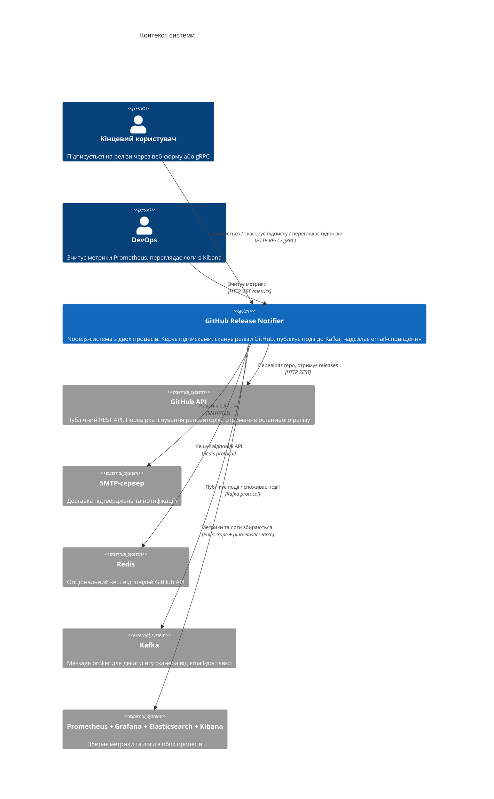
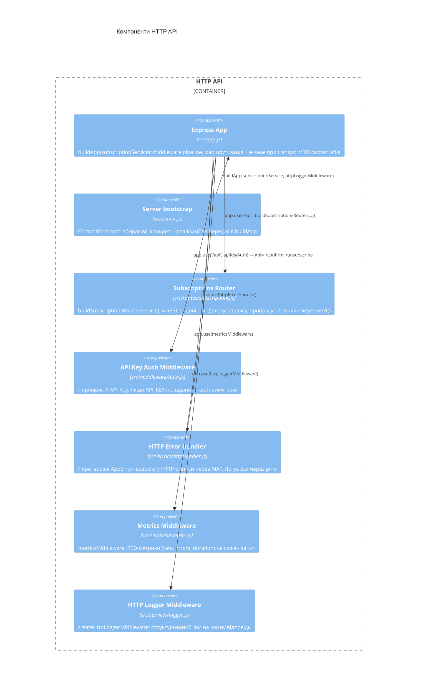
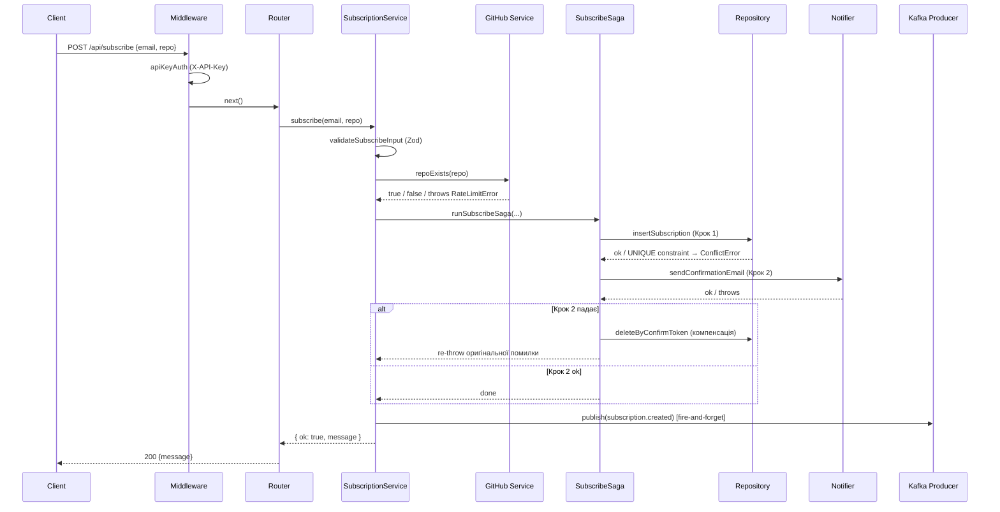
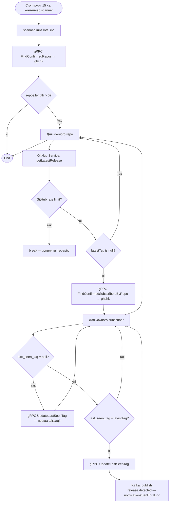
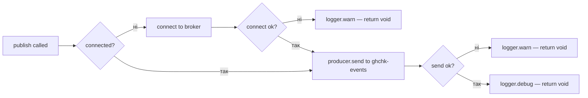
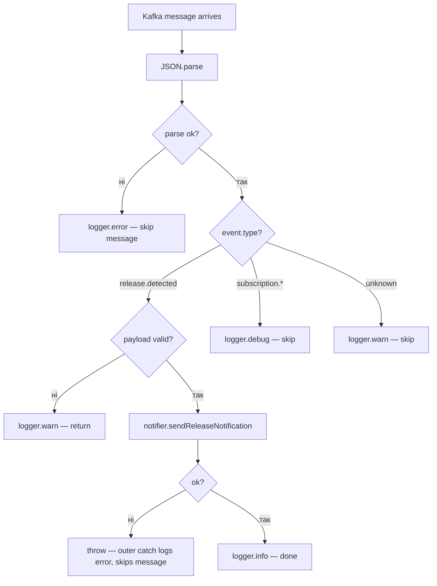
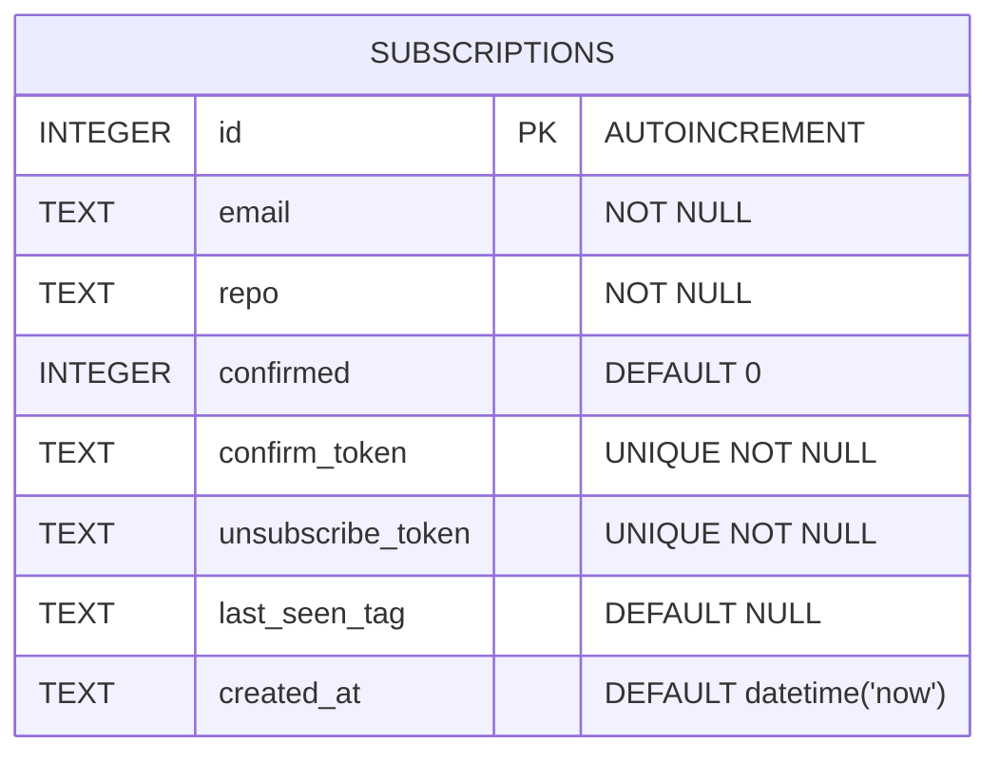
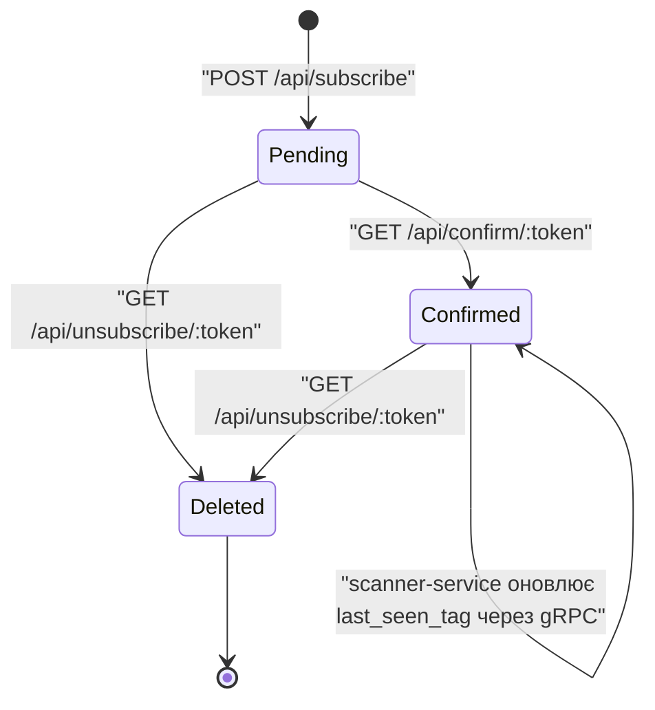
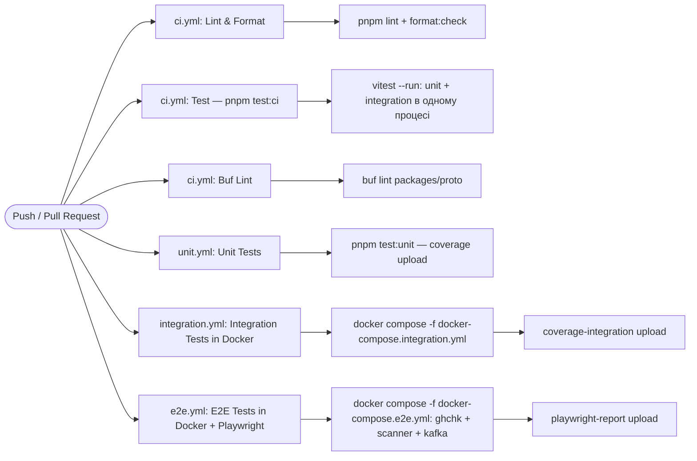

# System Design — GitHub Release Notifier

Сервіс стежить за релізами GitHub-репозиторіїв та надсилає email-сповіщення підписникам. Розгортається через `docker compose up --build`. Кодова база — pnpm-монорепо: застосунок `ghchk` (корінь), окремий мікросервіс `scanner-service`, спільні пакети `packages/common` (логер, кеш, Kafka, GitHub-клієнт, помилки, метрики) і `packages/proto` (gRPC-контракт, лінтується `buf`).

## 1. Вимоги

**Що система повинна робити:**

- Дозволяти користувачу підписатися на email-сповіщення про нові релізи будь-якого публічного GitHub-репозиторію
- Надсилати підтверджувальний лист після підписки (крок саги) — активація лише після кліку на `/api/confirm/:token`
- Давати можливість скасувати підписку за унікальним посиланням `unsubscribe`
- `scanner-service` кожні 15 хв перевіряє релізи через gRPC до `ghchk` і публікує події до Kafka; Notification Service в `ghchk` надсилає листи
- Надавати список підписок за email
- Перевіряти існування репозиторію через GitHub API перед збереженням
- Дублювати операції підписки через gRPC; той самий сервер обслуговує internal query-виклики від `scanner-service`
- Публікувати метрики Prometheus на `/metrics` в обох процесах
- Мати веб-форму підписки

**Нефункціональне:** uptime ≥ 99%, p95 latency < 500 мс, збірка відтворювана через `pnpm install --frozen-lockfile`, API захищений `X-API-Key` (крім публічних `/confirm` та `/unsubscribe`), unit-тести без зовнішніх залежностей, шари залежностей перевіряються `dependency-cruiser`, недоступність Kafka чи gRPC не зупиняє жоден процес.

**Обмеження:** два незалежні Node.js-процеси (`ghchk`, `scanner`), що інтегруються лише мережею — gRPC і Kafka; пряме імпортування коду одне одного заборонене правилом `no-service-to-service-source-imports`. SQLite належить лише `ghchk` (single-writer), `scanner` доступу до файла не має. Без `GITHUB_TOKEN` — 60 req/год на IP, спільних для обох процесів; з токеном — 5000 req/год. Kafka в KRaft-режимі, один брокер. Node.js ≥ 20, pnpm ≥ 9.

## 2. Оцінка навантаження

Очікувана кількість активних підписок — від 1 000 до 10 000, унікальних репозиторіїв — від 200 до 2 000, нових підписок на добу — ~100, підтверджень — ~80.

REST API отримує приблизно 10 req/хв на `POST /subscribe`, 8 req/хв на `/confirm`, 5 req/хв на `/subscriptions`, 60 req/хв на `/health`. `scanner-service` при R репозиторіях робить R запитів до GitHub кожні 15 хвилин (4×R/год) плюс R+1 gRPC-викликів до `ghchk` за цикл. Без токена — максимум ~15 репозиторіїв, з токеном — до ~1250 (квота спільна з `repoExists()` у `ghchk`).

По email: ~50 нових релізів на добу × ~5 підписників = ~250 release-листів + ~100 confirmation-листів.

SQLite: одна підписка ~300 байт, 10 000 підписок — ~3 МБ, зростання за рік — ~11 МБ. Redis кешує відповіді GitHub API з TTL 10 хвилин; з'єднання окреме в кожному процесі, за відсутності Redis обидва продовжують роботу. Kafka: тема `ghchk-events` (один партишн, retention 7 днів), ~250 повідомлень `release.detected` (публікує `scanner`) + ~180 subscription-подій (публікує `ghchk`) на добу; дві групи — `ghchk-notification-service`, `ghchk-scanner-service`.

## 3. Архітектура (C4)

### Рівень 1 — Контекст системи

```mermaid
C4Context
    title Контекст системи

    Person(user, "Кінцевий користувач", "Підписується на релізи через веб-форму або gRPC")
    Person(infra, "DevOps", "Зчитує метрики Prometheus, переглядає логи в Kibana")

    System(notifier, "GitHub Release Notifier", "Node.js-система з двох процесів. Керує підписками, сканує релізи GitHub, публікує події до Kafka, надсилає email-сповіщення")

    System_Ext(github, "GitHub API", "Публічний REST API. Перевірка існування репозиторію, отримання останнього релізу")
    System_Ext(smtp, "SMTP-сервер", "Доставка підтверджень та нотифікацій")
    System_Ext(redis, "Redis", "Опціональний кеш відповідей GitHub API")
    System_Ext(kafka, "Kafka", "Message broker для декаплінгу сканера від email-доставки")
    System_Ext(observability, "Prometheus + Grafana + Elasticsearch + Kibana", "Збирає метрики та логи з обох процесів")

    Rel(user, notifier, "Підписується / скасовує підписку / переглядає підписки", "HTTP REST / gRPC")
    Rel(notifier, github, "Перевіряє repo, отримує releases", "HTTP REST")
    Rel(notifier, smtp, "Надсилає листи", "SMTP/TLS")
    Rel(notifier, redis, "Кешує відповіді API", "Redis protocol")
    Rel(notifier, kafka, "Публікує події / споживає події", "Kafka protocol")
    Rel(infra, notifier, "Зчитує метрики", "HTTP GET /metrics")
    Rel(notifier, observability, "Метрики та логи збираються", "Pull/scrape + pino-elasticsearch")
```

### Рівень 2 — Контейнери

```mermaid
C4Container
    title Контейнери

    Person(user, "Користувач")

    Container_Boundary(app, "ghchk — головний застосунок (Docker container)") {
        Container(web, "HTTP API", "Express / Node.js", "REST-запити підписок, health, metrics")
        Container(grpc, "gRPC Server", "@grpc/grpc-js", "Публічні операції підписки + внутрішні query-RPC для scanner-service")
        Container(saga, "Subscribe Saga", "src/saga", "Оркеструє insert + confirmation-email з компенсацією")
        Container(query_svc, "Query Service", "src/services/queryService.js", "Обгортає репозиторій для gRPC-запитів сканера")
        Container(kafka_producer, "Kafka Producer", "kafkajs via @ghchk/common", "Публікує subscription.* до ghchk-events")
        Container(notification_svc, "Notification Service", "kafkajs consumer", "Споживає release.detected, надсилає листи")
        Container(db_layer, "DB Layer", "Kysely + better-sqlite3", "Єдиний власник SQLite-файлу")
        Container(cache_layer, "Cache Layer", "ioredis via @ghchk/common")
        Container(github_svc, "GitHub Service", "axios via @ghchk/common")
        Container(notifier_svc, "Notifier", "Nodemailer")
        Container(metrics_svc, "Metrics", "prom-client", "/metrics :3000")
        Container(logger_svc, "Logger", "pino via @ghchk/common")
    }

    Container_Boundary(scan, "scanner-service — окремий Docker container") {
        Container(scanner, "Release Scanner", "node-cron", "Кожні 15 хв опитує GitHub")
        Container(scanner_client, "Subscription gRPC Client", "@grpc/grpc-js", "Викликає ghchk:50051")
        Container(scanner_producer, "Kafka Producer", "kafkajs via @ghchk/common", "Публікує release.detected напряму")
        Container(scanner_github, "GitHub Service", "axios via @ghchk/common")
        Container(scanner_cache, "Cache Layer", "ioredis via @ghchk/common")
        Container(scanner_metrics, "Metrics", "prom-client", "Власний /metrics :9464")
    }

    ContainerDb(sqlite, "SQLite DB", "better-sqlite3", "app.db: читає й пише лише ghchk")
    ContainerDb(redis_db, "Redis", "спільний кеш GitHub-відповідей")
    ContainerDb(kafka_db, "Kafka", "apache/kafka KRaft", "тема ghchk-events")

    System_Ext(github_api, "GitHub API")
    System_Ext(smtp_server, "SMTP Server")
    System_Ext(es, "Elasticsearch")
    System_Ext(prom, "kafka-exporter + Prometheus")

    Rel(user, web, "HTTP :3000")
    Rel(user, grpc, "gRPC :50051")
    Rel(web, saga, "subscribe()")
    Rel(saga, db_layer, "insertSubscription / deleteByConfirmToken (compensation)")
    Rel(saga, notifier_svc, "sendConfirmationEmail()")
    Rel(grpc, saga, "subscribe()")
    Rel(web, db_layer, "CRUD")
    Rel(grpc, db_layer, "CRUD")
    Rel(grpc, query_svc, "FindConfirmedRepos / FindConfirmedSubscribersByRepo / UpdateLastSeenTag")
    Rel(query_svc, db_layer, "CRUD")
    Rel(web, kafka_producer, "publish(subscription.*)")
    Rel(grpc, kafka_producer, "publish(subscription.*)")
    Rel(kafka_producer, kafka_db, "produce")
    Rel(notification_svc, kafka_db, "consume")
    Rel(notification_svc, notifier_svc, "sendReleaseNotification()")
    Rel(web, github_svc, "repoExists()")
    Rel(github_svc, cache_layer, "cacheGet / cacheSet")
    Rel(github_svc, github_api, "HTTP")
    Rel(notifier_svc, smtp_server, "SMTP/TLS")
    Rel(db_layer, sqlite, "SQL queries")
    Rel(cache_layer, redis_db, "Redis protocol")
    Rel(logger_svc, es, "pino-elasticsearch")
    Rel(metrics_svc, prom, "scrape :3000/metrics")

    Rel(scanner, scanner_client, "findConfirmedRepos / findConfirmedSubscribersByRepo / updateLastSeenTag")
    Rel(scanner_client, grpc, "gRPC :50051")
    Rel(scanner, scanner_github, "getLatestRelease()")
    Rel(scanner_github, scanner_cache, "cacheGet / cacheSet")
    Rel(scanner_github, github_api, "HTTP")
    Rel(scanner, scanner_producer, "publish(release.detected)")
    Rel(scanner_producer, kafka_db, "produce")
    Rel(scanner_cache, redis_db, "Redis protocol")
    Rel(scanner_metrics, prom, "scrape :9464/metrics")
```

## 4. Компоненти

### 4.1 Composition Root, DI та шари монорепо

Кожен процес має власний composition root: `src/server.js` (`ghchk`) та `scanner-service/src/server.js` (`scanner`) збирають конкретні реалізації і передають їх у фабричні функції сервісів. Спільний код винесено до `packages/common` (логер, кеш, Kafka-клієнт/продюсер, GitHub-клієнт, помилки, метрики), а gRPC-контракт — до `packages/proto` (лінтинг і breaking-change перевірка через `buf`). `src/app.js` — чистий Express-додаток, що приймає готовий `subscriptionService` і не знає про інфраструктуру за ним.

Правила шарів у `.dependency-cruiser.cjs` — заборона циклів, доступ до `src/db`/`repositories` лише з композиційного кореня, `services/` не залежить від транспорту, домен (`validation`, `errors`) не залежить від сервісів, `packages/common` не знає про жоден із сервісів, а `src/` і `scanner-service/src/` не імпортують код одне одного — перевіряються тестом `tests/integration/architecture.test.js`.

### 4.2 HTTP API

Express 5 — необроблений rejected promise автоматично потрапляє до `errorHandler`, тому маршрути не потребують власного `try/catch`.

Middleware pipeline: логування → метрики → статика → публічні маршрути → API-auth → бізнес-маршрути → централізований обробник помилок.

#### Рівень 3 — Компоненти HTTP API

```mermaid
C4Component
    title Компоненти HTTP API

    Container_Boundary(web, "HTTP API") {
        Component(app, "Express App", "src/app.js", "buildApp(subscriptionService): middleware pipeline, маршрутизація. Не знає про transport/DB/cache/Kafka")
        Component(server, "Server bootstrap", "src/server.js", "Composition root: збирає всі конкретні реалізації та передає в buildApp")
        Component(router, "Subscriptions Router", "src/routes/subscriptions.js", "buildSubscriptionsRouter(service): 4 REST-ендпоінти. Делегує сервісу, пробрасує помилки через next()")
        Component(auth_mw, "API Key Auth Middleware", "src/middleware/auth.js", "Перевіряє X-API-Key. Якщо API_KEY не задано — auth вимкнено")
        Component(error_mw, "HTTP Error Handler", "src/errors/httpHandler.js", "Перетворює AppError-ієрархію у HTTP-статуси через MAP. Логує 5xx через pino")
        Component(metrics_mw, "Metrics Middleware", "src/services/metrics.js", "metricsMiddleware: RED-метрики (rate, errors, duration) на кожен запит")
        Component(logger_mw, "HTTP Logger Middleware", "src/services/logger.js", "createHttpLoggerMiddleware: структурований лог на кожну відповідь")
    }

    Rel(server, app, "buildApp(subscriptionService, httpLoggerMiddleware)")
    Rel(app, logger_mw, "app.use(httpLoggerMiddleware)")
    Rel(app, metrics_mw, "app.use(metricsMiddleware)")
    Rel(app, auth_mw, "app.use('/api', apiKeyAuth) — крім /confirm, /unsubscribe")
    Rel(app, router, "app.use('/api', buildSubscriptionsRouter(...))")
    Rel(app, error_mw, "app.use(httpErrorHandler)")
```

#### Потік підписки (POST /api/subscribe)

```mermaid
sequenceDiagram
    participant C as Client
    participant MW as Middleware
    participant R as Router
    participant SVC as SubscriptionService
    participant GH as GitHub Service
    participant SAGA as SubscribeSaga
    participant DB as Repository
    participant NF as Notifier
    participant KP as Kafka Producer

    C->>MW: POST /api/subscribe {email, repo}
    MW->>MW: apiKeyAuth (X-API-Key)
    MW->>R: next()
    R->>SVC: subscribe(email, repo)
    SVC->>SVC: validateSubscribeInput (Zod)
    SVC->>GH: repoExists(repo)
    GH-->>SVC: true / false / throws RateLimitError
    SVC->>SAGA: runSubscribeSaga(...)
    SAGA->>DB: insertSubscription (Крок 1)
    DB-->>SAGA: ok / UNIQUE constraint → ConflictError
    SAGA->>NF: sendConfirmationEmail (Крок 2)
    NF-->>SAGA: ok / throws
    alt Крок 2 падає
        SAGA->>DB: deleteByConfirmToken (компенсація)
        SAGA-->>SVC: re-throw оригінальної помилки
    else Крок 2 ok
        SAGA-->>SVC: done
    end
    SVC->>KP: publish(subscription.created) [fire-and-forget]
    SVC-->>R: { ok: true, message }
    R-->>C: 200 {message}
```

### 4.3 gRPC-сервер

gRPC-сервер — адаптер поверх `subscriptionService` і `queryService`, який обслуговує дві аудиторії: публічні операції підписки (ті самі 4, що й HTTP) для зовнішніх клієнтів, і три внутрішні query-RPC — `FindConfirmedRepos`, `FindConfirmedSubscribersByRepo`, `UpdateLastSeenTag` — які викликає лише `scanner-service`. `catchGrpcErrors` перехоплює `AppError`-ієрархію, конвертує в gRPC-статуси (`nice-grpc-common`) і фіксує `grpc_requests_total`/`grpc_errors_total` з лейблом `method`.

### 4.4 Scanner Service — окремий мікросервіс

Раніше сканер працював у тому самому процесі, що й HTTP API. Тепер це окремий Docker-контейнер (`scanner-service/`), що деплоїться і масштабується незалежно від `ghchk`. Прямого доступу до SQLite немає: замість SQL-запитів `subscriptionClient` (`scanner-service/src/grpc/subscriptionClient.js`) викликає gRPC-сервер `ghchk` за адресою `SUBSCRIPTION_SERVICE_GRPC_ADDR`. Kafka-продюсер, GitHub-клієнт і Redis-кеш — той самий код із `packages/common`, але окреме з'єднання в кожному процесі. Власний HTTP-сервер на порту `METRICS_PORT` (типово 9464) віддає лише `/metrics`.

Ключова задача незмінна: не надіслати лист про реліз, що вже існував до підписки — `last_seen_tag = NULL` означає першу фіксацію без публікації події. При rate limit від GitHub ітерація зупиняється.

```mermaid
flowchart TD
    A([Cron кожні 15 хв, контейнер scanner]) --> B[scannerRunsTotal.inc]
    B --> C[gRPC FindConfirmedRepos → ghchk]
    C --> D{repos.length > 0?}
    D -- ні --> Z([End])
    D -- так --> E[Для кожного repo]
    E --> F[GitHub Service: getLatestRelease]
    F --> G{GitHub rate limit?}
    G -- так --> H[break — зупинити ітерацію]
    G -- ні --> I{latestTag is null?}
    I -- так --> E
    I -- ні --> J[gRPC FindConfirmedSubscribersByRepo → ghchk]
    J --> K[Для кожного subscriber]
    K --> L{last_seen_tag = null?}
    L -- так --> M[gRPC UpdateLastSeenTag — перша фіксація]
    M --> K
    L -- ні --> N{last_seen_tag = latestTag?}
    N -- так --> K
    N -- ні --> O[gRPC UpdateLastSeenTag]
    O --> P[Kafka: publish release.detected — notificationsSentTotal.inc]
    P --> K
    K --> E
    E --> Z
```

### 4.5 Saga підписки

`subscribe()` виконує оркестровану сагу (`src/saga/subscribeSaga.js`) з компенсацією: Крок 1 — вставка `pending`-рядка в БД; Крок 2 — синхронна відправка листа-підтвердження. Якщо Крок 2 падає, оркестратор виконує компенсацію Кроку 1 — видаляє щойно вставлений рядок за `confirmToken`, щоб не залишати «підписки без листа». Помилка компенсації логується окремо як `orphaned subscription`, а оригінальна помилка листа прокидається далі.

### 4.6 Message Broker (Kafka)

Kafka декаплить виявлення релізу від доставки email. Продюсер тепер існує у двох процесах: `ghchk` публікує `subscription.*`, `scanner-service` публікує `release.detected` напряму, без проходження через `ghchk`. Обидва використовують спільну фабрику `createProducer()` з `packages/common/kafka/producer.js` (lazy connect, graceful degradation), огорнуту власними лічильниками `kafka_producer_messages_total`/`_errors_total`.

| Тип події                | Публікує                   | Споживає                    | Ціль              |
| ------------------------ | -------------------------- | --------------------------- | ----------------- |
| `subscription.created`   | ghchk: SubscriptionService | —                           | Аудит             |
| `subscription.confirmed` | ghchk: SubscriptionService | —                           | Аудит             |
| `subscription.deleted`   | ghchk: SubscriptionService | —                           | Аудит             |
| `release.detected`       | scanner-service            | ghchk: Notification Service | Email-нотифікація |

```mermaid
flowchart LR
    A[publish called] --> B{connected?}
    B -- ні --> C[connect to broker]
    C --> D{connect ok?}
    D -- ні --> E[logger.warn — return void]
    D -- так --> F[producer.send to ghchk-events]
    B -- так --> F
    F --> G{send ok?}
    G -- ні --> H[logger.warn — return void]
    G -- так --> I[logger.debug — return void]
```

**Notification Service** (`src/services/notificationService.js`, живе лише в `ghchk`) — фабрика `createNotificationService({ notifier })` з `start()`, `stop()` і публічним `handleEvent(event)` для unit-тестування без Kafka.

```mermaid
flowchart TD
    A[Kafka message arrives] --> B[JSON.parse]
    B --> C{parse ok?}
    C -- ні --> D[logger.error — skip message]
    C -- так --> E{event.type?}
    E -- release.detected --> F{payload valid?}
    F -- ні --> G[logger.warn — return]
    F -- так --> H[notifier.sendReleaseNotification]
    H --> I{ok?}
    I -- ні --> J[throw — outer catch logs error, skips message]
    I -- так --> K[logger.info — done]
    E -- subscription.* --> L[logger.debug — skip]
    E -- unknown --> M[logger.warn — skip]
```

Помилки `sendReleaseNotification` не зупиняють consumer: `eachMessage` обгорнутий у `try/catch`, повідомлення пропускається при помилці. При недоступності Kafka HTTP API продовжує приймати підписки, `scanner-service` продовжує перевіряти релізи (лог `warn`), email-доставка тимчасово не відбувається. Після відновлення consumer перечитає пропущене завдяки retention.

### 4.7 База даних

SQL-запити живуть у `src/repositories/`, доступ до них — виключно з `ghchk` (composition root і `queryService`); `scanner-service` драйвера SQLite не має взагалі. Singleton-з'єднання, WAL-режим для паралельного читання, автоматичні міграції при старті через Kysely Schema Builder.

### 4.8 Кеш (Redis)

Спільний код `packages/common/services/cache.js`, кожен процес тримає власне з'єднання. Опціональний шар: `cacheGet` завжди повертає `null`, `cacheSet` — no-op при недоступності Redis. Прапорець `connected` — через `on('ready')`/`on('error')`, автовідновлення.

### 4.9 GitHub API-клієнт

Спільний клієнт (`packages/common/services/github.js`) використовують і `ghchk` (`repoExists` на subscribe), і `scanner-service` (`getLatestRelease` щоцикл) — обидва споживають один ліміт запитів GitHub. HTTP 429 перетворюється на `RateLimitError` (з `retryAfter`), 404 — на `false`/`null`. Кешується за ключами `repo:exists:{repo}` і `repo:release:{repo}`.

### 4.10 Email-нотифікатор (Nodemailer)

Шаблони листів у `src/emails/` — чисті функції, що повертають `{to, subject, text, html}`. Transport injected ззовні. `sendConfirmationEmail` викликається синхронно всередині саги (не через Kafka). `sendReleaseNotification` — лише з Notification Service після `release.detected`.

### 4.11 Логування (Pino)

Базова конфігурація — у `packages/common/services/logger.js`: `pino-pretty` в development, stdout JSON + `pino-elasticsearch` за `ELASTICSEARCH_URL` у продакшені; `authorization`, `x-api-key`, `password` замінюються на `[REDACTED]`. `scanner-service` створює дочірній логер `logger.child({ server: "scanner" })`, щоб розрізняти джерело записів у спільному Kibana-індексі. HTTP-логер `ghchk` вибирає рівень автоматично: `info` для 2xx/3xx, `warn` для 4xx, `error` для 5xx.

### 4.12 Метрики Prometheus

Кожен процес тримає власний `Registry` і власний `/metrics` (`ghchk`:3000, `scanner`:9464); Prometheus скрейпить обидва плюс `kafka-exporter`:9308.

| Метрика                                                                     | Тип               | Сервіс         | Опис                                                            |
| --------------------------------------------------------------------------- | ----------------- | -------------- | --------------------------------------------------------------- |
| `http_requests_total`, `http_request_duration_seconds`, `http_errors_total` | Counter/Histogram | ghchk          | RED-метрики HTTP                                                |
| `grpc_requests_total`, `grpc_errors_total`                                  | Counter           | ghchk          | RED-метрики gRPC, лейбл `method`                                |
| `subscriptions_total`, `confirmed_subscriptions_total`                      | Gauge             | ghchk          | Стан БД                                                         |
| `kafka_producer_messages_total`, `kafka_producer_errors_total`              | Counter           | ghchk, scanner | Спільна форма з `packages/common`, лейбли `topic`, `event_type` |
| `kafka_consumer_messages_total`, `kafka_consumer_errors_total`              | Counter           | ghchk          | Notification Service consumer                                   |
| `scanner_runs_total`, `scanner_errors_total`                                | Counter           | scanner        | Запуски й помилки cron-циклу                                    |
| `notifications_sent_total`                                                  | Counter           | scanner        | Надіслано подій `release.detected`                              |

Плюс `prom-client.collectDefaultMetrics` у кожному процесі окремо.

## 5. База даних

```mermaid
erDiagram
    SUBSCRIPTIONS {
        INTEGER id PK "AUTOINCREMENT"
        TEXT email "NOT NULL"
        TEXT repo "NOT NULL"
        INTEGER confirmed "DEFAULT 0"
        TEXT confirm_token "UNIQUE NOT NULL"
        TEXT unsubscribe_token "UNIQUE NOT NULL"
        TEXT last_seen_tag "DEFAULT NULL"
        TEXT created_at "DEFAULT datetime('now')"
    }
```

Обмеження: `UNIQUE(email, repo)` — запобігає дублікатам, `UNIQUE(confirm_token)` та `UNIQUE(unsubscribe_token)` — унікальність токенів. Таблиця живе лише у файлі `ghchk`; `scanner-service` бачить ці дані лише через gRPC.

```mermaid
stateDiagram-v2
    [*] --> Pending: "POST /api/subscribe"
    Pending --> Confirmed: "GET /api/confirm/:token"
    Pending --> Deleted: "GET /api/unsubscribe/:token"
    Confirmed --> Deleted: "GET /api/unsubscribe/:token"
    Confirmed --> Confirmed: "scanner-service оновлює last_seen_tag через gRPC"
    Deleted --> [*]
```

Життєвий цикл: Pending (`confirmed = 0`, сага надсилає лист, подія `subscription.created`) → Confirmed (`confirmed = 1`, подія `subscription.confirmed`) → перша перевірка `scanner-service` (gRPC `UpdateLastSeenTag`, `last_seen_tag` був `NULL`, подія не публікується) → Active (`release.detected` при зміні тега, Notification Service надсилає email).

## 6. Стійкість до збоїв

**Kafka** — `producer.publish()` в обох процесах ніколи не кидає помилку. Consumer у `ghchk` не стартує при недоступності брокера (лог `error`), HTTP API працює нормально. Після відновлення consumer перечитає пропущені `release.detected` завдяки retention і збереженому offset.

**gRPC (scanner → ghchk)** — при недоступності `ghchk` виклики `subscriptionClient` падають; `scanAllRepos` ловить помилку для конкретного repo, інкрементує `scanner_errors_total`, продовжує наступний цикл. `scanner-service` не крашиться і не блокує `ghchk`.

**Redis** — усі операції кешу в `try/catch`, повертають `null`/`void`. Автовідновлення при `on('ready')`.

**GitHub 429** — HTTP повертає 429 клієнту `ghchk`; `scanner-service` зупиняє поточний run (`break`) і чекає наступного cron-тіку. Обидва процеси конкурують за одну квоту GitHub.

**SMTP** — падіння Кроку 2 саги компенсується видаленням pending-рядка (§4.5); помилка в Notification Service — лог і пропуск повідомлення, offset комітиться.

**SQLite** — WAL-режим, єдиний писар (`ghchk`). Горизонтальне масштабування не підтримується; при потребі — міграція на PostgreSQL.

**Збій scanner-контейнера** — не впливає на `ghchk`: незалежний процес з власним `restart: unless-stopped`.

**Elasticsearch** — `pino-elasticsearch` падає тихо в обох процесах; stdout-транспорт продовжує писати.

## 7. CI/CD та якість коду

П'ять незалежних задач запускаються паралельно на кожен push/PR: лінт і формат, повний прогін vitest, `buf lint` контракту `packages/proto`, окремий unit-раннер із coverage, Docker-інтеграційні тести, і Docker+Playwright E2E, що піднімає обидва контейнери — `ghchk` і `scanner`.

```mermaid
flowchart LR
    PR([Push / Pull Request]) --> L[ci.yml: Lint & Format]
    PR --> T[ci.yml: Test — pnpm test:ci]
    PR --> BL[ci.yml: Buf Lint]
    PR --> U[unit.yml: Unit Tests]
    PR --> I[integration.yml: Integration Tests in Docker]
    PR --> E[e2e.yml: E2E Tests in Docker + Playwright]

    L --> L1[pnpm lint + format:check]
    T --> T1[vitest --run: unit + integration в одному процесі]
    BL --> BL1[buf lint packages/proto]
    U --> U1[pnpm test:unit — coverage upload]
    I --> I1[docker compose -f docker-compose.integration.yml]
    I1 --> I2[coverage-integration upload]
    E --> E1[docker compose -f docker-compose.e2e.yml: ghchk + scanner + kafka]
    E1 --> E2[playwright-report upload]
```
